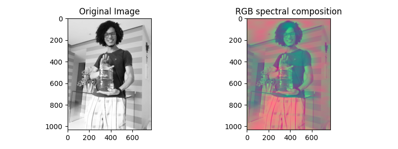

# spectralcomp

This python module makes spectral decomposition of an image into 3 channels. In other words, the image is led to Fourier domain, where the frequency components are separated in three images. Those images are then given as a result image with three channels, so that you can easily make an RGB composition of them.


## Usage as an image filter

I discovered spectral decomposition as a technique for interpretation of seismic lines (applied Geophysics), but you can also use it as a filter for photos, no one is going to arrest you. Make sure to play around with spectralcomp parameters!


## Dependencies

You need `Python 3+` and `pip 3+` in order to use this script.

| Python libraries needed |
| - |
| numpy |
| matplotlib |
| pillow |

If your distribution still calls Python as "python2", instead of "python3" (you can tell that by sending `realpath $(which python)`), as Debian and Debian based distros do (last checked in october 2019; Ubuntu and Linux Mint were tested distros), use pip3 instead of pip to install dependencies:

```sh
pip install --user numpy, matplotlib, pillow
# or, if  python3 isn't default,
pip3 install --user numpy, matplotlib, pillow
```


### Picture examples

<p align="center">

<p align="center">

<p align="center">

<p align="center">

<p align="center">


## Contact

  - **Name:** Marcos Conceição
  - **E-mail:** [marcosrdac@gmail.com](mailto:marcosrdac@gmail.com)
  - **GitHub:** [marcosrdac](github.com/marcosrdac)
  - **Website:** [marcosrdac.github.io](http://marcosrdac.github.io)
  - **YouTube:** [Marcos Conceição](https://www.youtube.com/channel/UCeMnyCimF8pJjTM5MxFdRlw/)
